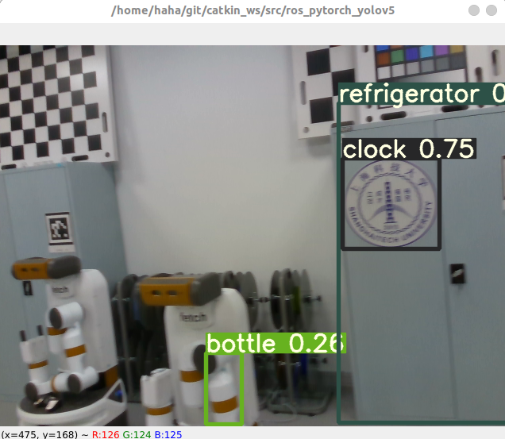

# Ros_pytorch_yolov5
A ROS wrapper for [yolov5](https://github.com/ultralytics/yolov5) (v6.1 version).

I have tested this repo at intel cpu and single Nvidia-GPU. If you have any questions, feel free to create an issue or directly send me an email to jiuerrose@outlook.com.

## Requirements
ROS Noetic(Recommanded) or Melodic 

## Running
Tracking the detection using opencv. (Rviz may be better)

# Quick Start
see [How_to_build_and_run](./How_to_build_and_run.md) for more details.

# Reference
[yolov3_pytorch_ros](https://github.com/vvasilo/yolov3_pytorch_ros)

[yolov5](https://github.com/ultralytics/yolov5)
